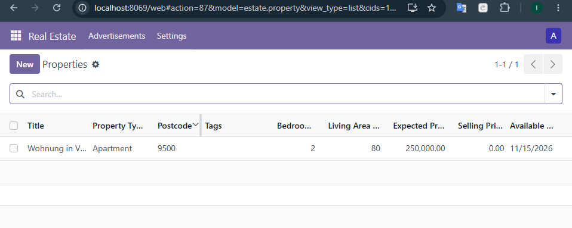
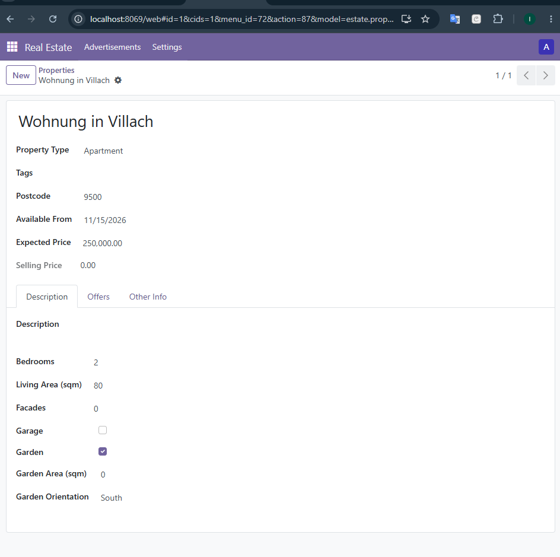

# Odoo 17 Estate Module

Implementation of the Odoo Server Framework 101 tutorial through Chapter 7.

## Features

- Real estate property management
- Property types and tags
- Property offers
- Buyer and salesperson relations
- Custom list, form and search views
- Access rights for internal users

## Property List

## Property Form

